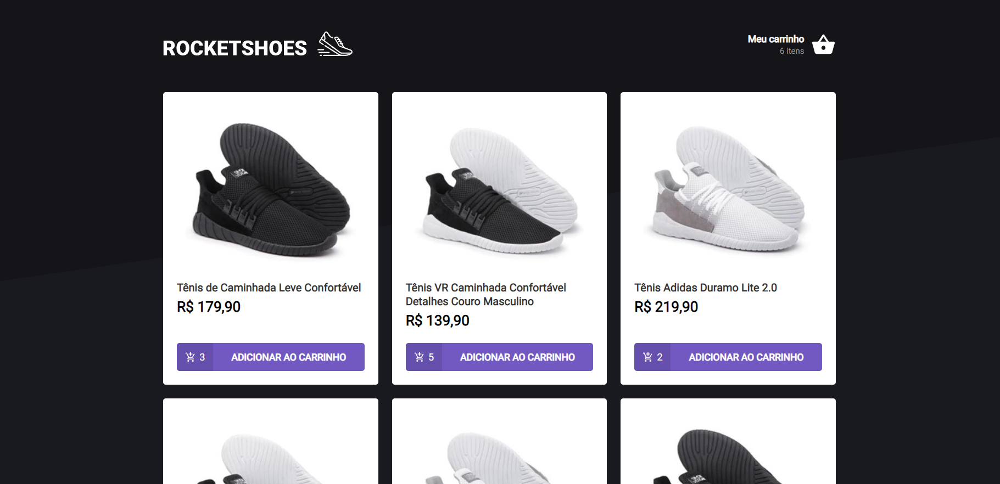
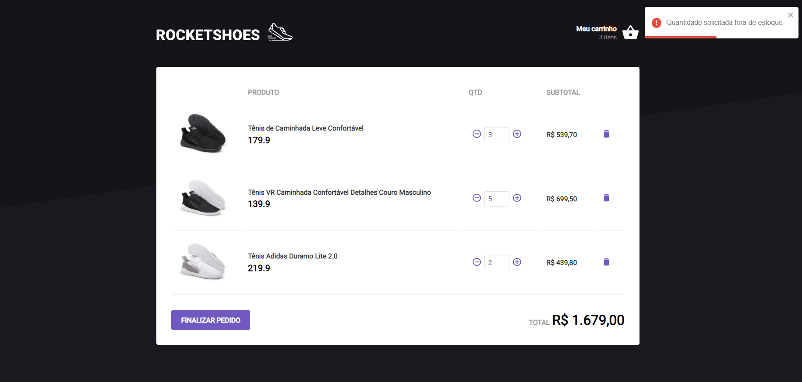

<h1 align="center" >Criando um hook de carrinho de compras </h1>

Desafio do ignite da trilha de ReactJs para praticar hooks.
<p>A aplicação foi feita pela equipe do Ignite da Rocketseat, e foi passada a atividade para implementar algumas funcionalidades, como: </p>

- Adicionar um novo produto ao carrinho;
- Remover um produto do carrinho;
- Alterar a quantidade de um produto no carrinho;
- Cálculo dos preços sub-total e total do carrinho;
- Validação de estoque;
- Exibição de mensagens de erro com `toast`;
- Salvar carrinho com LocalStorage;

--------------------------------

[x] JSON Server
- Foi utilizado o JSON Server para simular uma API que possui as informações dos produtos e do estoque.
- Para acessar as informações do JSON, basta rodar o `yarn server` e entrar nas rotas `/stock` e ``/products`` em localhost na porta `3333`.<br>
- `http://localhost:3333/stock`
- `http://localhost:3333/products`

## Execução do projeto:

Para rodar o projeto, primeiro é necessário clonar o repositório e abrir em uma IDE, VSCode por exemplo.

```bash
# Clonar repositório
$ git clone https://github.com/Edusorrentino10/ignite-carrinho-de-compras.git

# Acessar pasta do projeto clonado
$ cd ignite-carrinho-de-compras

# Instalar dependências
$ yarn


# Rodar a Fake API com JSON Server
$ yarn server

# Abrir um novo terminal e executar aplicação
$ yarn start

# Para remover erros de tipagem, executar em um novo terminal:
$ yarn add @types/react

# E em seguida rodar:
$ yarn add @types/styled-components

# Abrir aplicação na porta 8080, acessando: http://localhost:8080
```


<h2></h2>
<h2></h2>

Feito por <a href="https://github.com/Edusorrentino10">Eduardo Sorrentino</a>.

Linkedin: https://linkedin.com/in/eduardo-sorrentino/